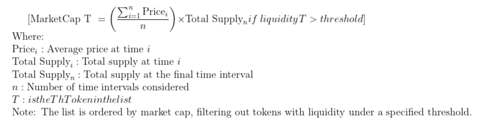
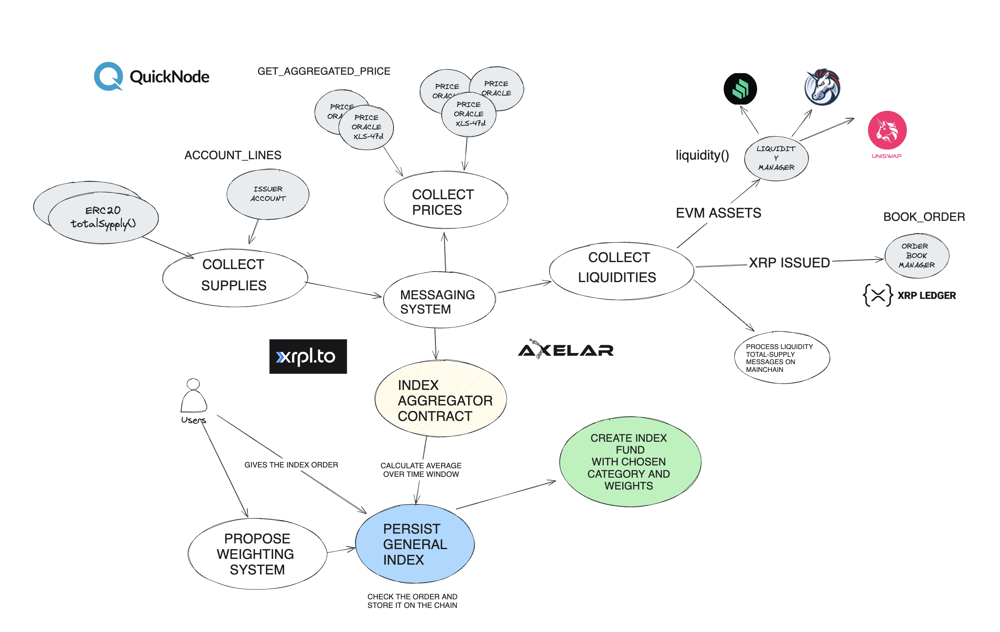

# Description

In our previous hackathon, we introduced XTF, a solution for creating decentralized ETFs. This enables users to lock tokens across various chains in buckets and fractionalize them into shares in the EVM Sidechain Ledger.

During these months, we received a lot of positive feedback. However, one recurring concern from the community was about the centralization risks in selecting the list of tokens in the index.

Taking this feedback to heart, in this hackathon, we worked on a prototype to enhance decentralization when determining indexes. 
Our solution uses on-chain data from the XLS-47d price oracle to aggregate data from multiple sources and port them to the EVM Side Chain through Axelar’s General Message Passing (GMP) protocol. The XLS-47d get_aggregate_price function retrieves the mean, median, and average from multiple sources, mitigating collusion risks related to a single entity source.

For EVM assets we pull onchan data about liquidity using the `liquidity` method of IUniswapPool standard interface and supply data using the totalSupply method of ERC20 tokens.  

For XRP assets we fetch data about liquidity by using the `book_offers` command and comparing our token to reference coins like XRP/USD, and supply data through the account_lines command for each XRP token.

We employ the Axelar Bridge to propagate prices, supplies and liquidity of XRP tokens to the EVM sidechain, ensuring consistent metrics with EVM tokens that are used to calculate the market capitalization:

Market Cap = totalSupply * AVG(prize) for all Token T with liquidity(T)> liquidity_threshold) 



A smart contract in the EVM Sidechai, IndexAggreagtor stores this information about assets and persist it in an index when a new XTF fund needs to be created.

By defining our indexes using on-chain data and aggregating secure oracle data rather than third-party inputs, we aim to provide a more trustworthy solution.





# Technical Description

The XTF protocol functions similarly to a traditional finance (TradFi) ETF. A TradFi ETF compiles a list of assets (an index), assigns weights to them, allocates a proportional amount of each asset into a bucket based on these weights, and then fractionalizes the bucket into ETF shares, representing ownership of the bucket.

Similarly, the XTF protocol requires an array of TokenInfo in its contract constructor. This TokenInfo array contains crucial details such as:
- Token address
- Chain ID (as XTF operates as a multichain protocol)
- Quantity required
- Address of the associated price oracle contract

These details enable the XTF protocol to accurately manage and fractionalize the assets within its ecosystem.


**The challenge is to determine, in a fair and collusion-resistant way, who decides the list of tokens and their quantities.**

Competitors in the space likeallows the first one to have the issuer known as the 

Competitors in the space, such as  [TokenSets](https://www.tokensets.com/#/explore) and [IndexCoop](https://indexcoop.com/), rely on different methods for defining token lists. TokenSets allows the issuer, known as the manager, to define the token lists, with users trusting the manager based on their track record. IndexCoop relies on trusted parties like Bankless and DeFi Pulse to curate the token lists. However, these methods expose users to collusion risks.

Our solution aims to recreate on-chain operations to determine a proper index. We collect the following metrics over a time interval  t , divided into smaller intervals  t_x :

See the method: (see `collectPriceFeeds()` method)
- Total Supply: Circulation of the tokens
- Average Price: Average price over the time interval  t_1 

We ensure an index can only be calculated if a sufficient number of data points are collected, maintaining data reliability. Additionally, we have a bribe system in place to reward those who call the methods to pull the data within the required intervals, incentivizing timely and accurate data collection. 


## DATA COLLECTION

While the main contract that tracks all data and liquidity and persists the index sits on the **XRP EVM SIDECHAIN** different contracts and systems are in place to collect on-chain data for assets sitting on other blockchains.  Data collection is different depending on the blockchain technology in which are the assets. 

If the assets are on EVM chains data collections is done interactign with contracts directly:


- Total Supply:  `IER20(tokenInfo[i]._address).totalSupply()` method
- Price(n): `(, int256 answer, , , )=AggregatorV3Interface(tokenInfo[i]._aggregator).latestRoundData`();
- Liquidity(n): using the `IUniswap(uniswapfactory).liquidy()`


Once we have enough samples we can call the `updateTokenParams()` to process the collected data and calculate the aggregated data used for the index metric calculation.

If the assets are on not the mainchain (not on **XRP EVM SIDECHAIN**) the aggregated on-chain data (supplies,liquidity are sent to mainchain through a GMP call of Axelar Bridge).

```
        bytes memory payload = abi.encode(
            IndexUpdateMessage({
                supplyMessages: _supplyMessages,
                liquidityMessages: _liquidityMessages
            })
        );
        // execute(chainId, mainChainId, payload);
        IAxelarGateway(axelarGateway).callContract(
            chainSelectorIdToDestinationChain[chainId],
            toAsciiString(mainChainAddress),
            payload
        );

```

If the assets are on the mainchain, i.e. on the **XRP EVM SIDECHAIN**, we processed messages from the Axelar Bridge and we store updated metrics in the smart contract.

As per Axelar docs we implemented the `execute` method that can be executed only bt the Axelar Gaetway

```
    function _execute(
        string calldata sourceChain_,
        string calldata sourceAddress_,
        bytes calldata payload_
    ) internal override {
        (IndexUpdateMessage memory message) = abi.decode(payload_, (IndexUpdateMessage));
        for (uint256 i = 0; i < message.liquidityMessages.length; i++) {
            LiquidityMessage memory liquidityMessage = message.liquidityMessages[i];
            liquidityMessages.push(liquidityMessage);
        }
        for (uint256 i = 0; i < message.supplyMessages.length; i++) {
            SupplyMessage memory supplyMessage = message.supplyMessages[i];
            supplyMessages.push(supplyMessage);
        }
    }
```

For XRPL ledgers type, data collection is made as follows:
A list of meaningul tokens is downloaded by `https://xrpl.to`.
We then interact with a `rippled/clio` node of at leaset version `v2.0.21` and issue comamnds to get the metrics:

Note that most of the public JSON-RPC available do not allow to send write commands or are not comaptibile with `v2.0.21` that supports [XLS-47d](https://github.com/XRPLF/XRPL-Standards/discussions/129). This unfortuantely does not allow to even create oracles, with the `createOracle` command.

**NOTE:***: For this reason we have mocking those XRPL node endpoints, making sure the responses were the same as the ones we would have received from a node.
See `packages/nextjs/pages/api` for the mock endpoints implementations.

- Total Supply: for every token, we get the supply using the `account_lines` command on the issuer account to get the total supply of the token as the - (balance). Balance of the issuer should be negative.
- mean(price): For every token, we use `get_aggregated_price` from [XLS-47d](https://github.com/XRPLF/XRPL-Standards/discussions/129) passing a list of trusted oracles**. To be consistent with EVM chain solution we use `USD` as price unit.
- Liquidity of Tokens: For every token, we get the Liquidity using the `book_offers` command on the issuer account to get the orders of the token related to a reference token (e.g. XRP). We sum all the orders to get the total liquidity of the token.
- Push: Finally we push data to the MainChain, i.e. **XRP EVM SIDECHAIN** using the Axelor Bridge by adding meta data using a `payment` command


In this case the oracles have been pre vetted by the protocol ownwer as in this example **
```
{
  "method": "get_aggregate_price",
  "params": [
    {
      "ledger_index": "current",
      "base_asset": "XRP",
      "quote_asset": "USD",
      "trim": 20,
      "oracles": [
        {
          "account": "rp047ow9WcPmnNpVHMQV5A4BF6vaL9Abm6",
          "oracle_document_id": 34
        },
        {
          "account": "rp147ow9WcPmnNpVHMQV5A4BF6vaL9Abm7",
          "oracle_document_id": 56
        },
        {
          "account": "rp247ow9WcPmnNpVHMQV5A4BF6vaL9Abm8",
          "oracle_document_id": 2
        },
        {
          "account": "rp347ow9WcPmnNpVHMQV5A4BF6vaL9Abm9",
          "oracle_document_id": 7
        },
        {
          "account": "rp447ow9WcPmnNpVHMQV5A4BF6vaL9Abm0",
          "oracle_document_id": 109
        }
      ]
    }
  ]
}

```

Finally if we have collected all the required data we can persist the index using `persistIndex`

This functions had challenges related to the gas consumption of certain operations, while sorting by market cap. 

Initial implementations included Solidity code to sort assets based on specific criteria. However, when simulating a real-world environment with potentially thousands of assets across multiple chains, it became prohibitively expensive to keep the index ordered every time prices were updated *O(nlogn)*. This approach was not feasible to execute all at once due to the high gas costs. 

I initially tried to apply as much filtering as possible by category, liquidity, and excluding certain chains, and explored various sorting algorithms based on the way we updated data.

However, in the end, **I decided not to order the assets on-chain**. Instead, the contract records the prices and the time of the last update. When we need to define the index, we pull the data off-chain, **sort it off-chain**, and then pass it to the index function that verifies in *O(n)* time that the provided order is correct. This approach significantly reduces gas costs and ensures the system remains feasible and efficient


===

Quicknode endpoint:
https://clean-soft-shard.xrp-testnet.quiknode.pro/c4578c13478cf1d63bf30c80d75b2651ffa56a69/


curl -X POST https://clean-soft-shard.xrp-testnet.quiknode.pro/c4578c13478cf1d63bf30c80d75b2651ffa56a69/ -H "Content-Type: application/json" -d '{
  "method": "submit",
  "params": [
    {
      "tx_json": {
        "TransactionType": "CreateOracle",
        "Account": "rLXbPN2kiiQ4skm7nU7Qe7ADNR8mqKLAyZ",
        "Symbol": "XRP",
        "SymbolClass": "63757272656E6379",
        "PriceUnit": "USD",
        "Provider": "70726F7669646572"
      },
      "secret": "sEdT8WPqpEAVpygKSrA6svMHYU8NbaG"
    }
  ]
}'


curl -X POST https://s.devnet.rippletest.net:51234/ -H "Content-Type: application/json" -d '{   
  "method": "submit",
  "params": [
    {
      "tx_json": {
        "TransactionType": "CreateOracle",
        "Account": "rKqgCYs5FDZR7Rrw17TVMsHQnRrWHc8qDY",
        "Symbol": "XRP",
        "SymbolClass": "63757272656E6379",
        "PriceUnit": "USD",
        "Provider": "70726F7669646572"
      },
      "secret": "sEdVEGpSDtt9WWwEBkhXFK1aSHTVXSb"
    }
  ]
}'